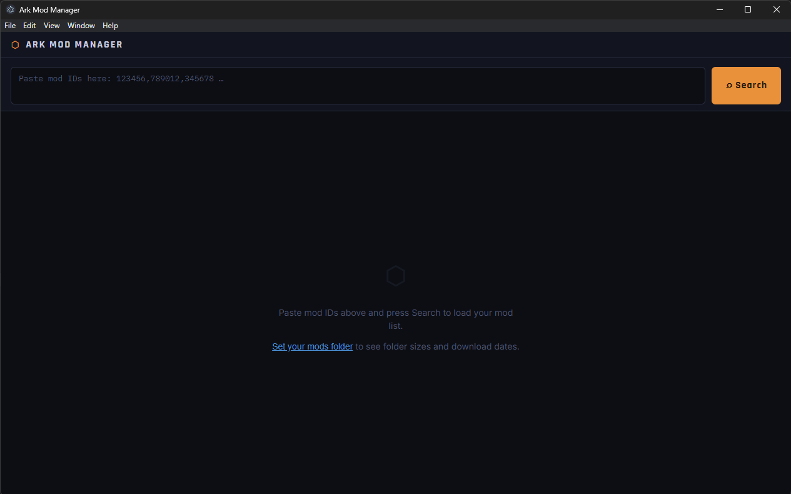

# Ark Mod Manager

[](https://anthropic.com)

A desktop app for managing mod load order on **ARK: Survival Evolved** dedicated servers.

Paste your mod ID list from ARK Server Manager, reorder mods with a click, and copy the result straight back — no more hand-editing comma-separated strings.

---

## Features

- **Paste & search** — paste any comma-separated mod ID list and fetch live details from Steam Workshop
- **Mod table** — see mod name, type, last downloaded, last updated (author), and local folder size in one view
- **Reorder** — move mods up/down with arrow buttons; the load order number updates instantly
- **Add / remove** — add individual mods by ID, remove any mod from the list
- **Filter** — search the loaded list by mod ID or name
- **Import** — import a mod list from a `.txt`, `.ini`, or `.cfg` file
- **Open folder** — jump straight to your local ARK mods directory
- **Copy output** — copies the final ordered `id1,id2,id3` string to clipboard, ready to paste back into ARK Server Manager

---

## Download

Go to the [Releases](../../releases) page and download the latest `Ark Mod Manager Setup x.x.x.exe`.

> **Windows SmartScreen warning**: Because the installer is not code-signed, Windows may show a "Windows protected your PC" dialog. Click **More info → Run anyway** to proceed. This is normal for open-source tools without a paid code signing certificate.

---

## Screenshot



---

## Development

### Prerequisites

- [Node.js](https://nodejs.org/) v18+
- npm v9+

### Setup

```bash
# Install dependencies
npm install

# Run in development mode (React dev server + Electron live reload)
npm run electron-dev

# Build distributable Windows installer
npm run electron-build
```

The installer is output to `dist/Ark Mod Manager Setup x.x.x.exe`.

---

## Project structure

```
ark-mod-manager/
├── .github/
│   └── workflows/
│       └── release.yml      # Auto-build + publish on git tag
├── electron/
│   ├── main.js              # Electron main process (IPC, file system, Steam fetch)
│   └── preload.js           # Secure context bridge (renderer ↔ main)
├── public/
│   └── index.html           # HTML shell with Content Security Policy
├── src/
│   ├── App.js               # Main React UI component
│   ├── App.css              # Styles (dark industrial theme)
│   ├── index.js             # React entry point
│   └── utils/
│       └── steam.js         # Steam API helpers, parseModIds, formatters
├── .gitignore
├── LICENSE
├── package.json
└── README.md
```

---

## How it works

1. Paste your existing mod ID list (from ARK Server Manager or `GameUserSettings.ini`)
2. Press **Search** — the app calls Steam's `ISteamRemoteStorage/GetPublishedFileDetails` API via the Electron main process (bypassing CORS) to fetch names, types, and update timestamps
3. Optionally set your local mods folder via **⋯ Set Path** to see folder sizes and download dates
4. Use **▲▼** to reorder, **✕** to remove, **+ Add Mod** to add by ID
5. Press **⎘ Copy Output** to copy the ordered `modid1,modid2,modid3` string back to your clipboard

---

## Default mods folder locations

| OS | Path |
|----|------|
| Windows | `C:\Program Files (x86)\Steam\steamapps\common\ARK\ShooterGame\Content\Mods` |
| Linux | `~/.steam/steam/steamapps/common/ARK/ShooterGame\Content\Mods` |

---

## Notes

- The Steam API endpoint used (`GetPublishedFileDetails`) does not require an API key
- Batches of up to 100 mod IDs are fetched per request
- The app works without a mods folder path set — folder size and download date columns will show `—`
- Mod IDs must be 5–12 digit numbers; anything else is silently skipped with a count shown

---

## License

[MIT](LICENSE)
