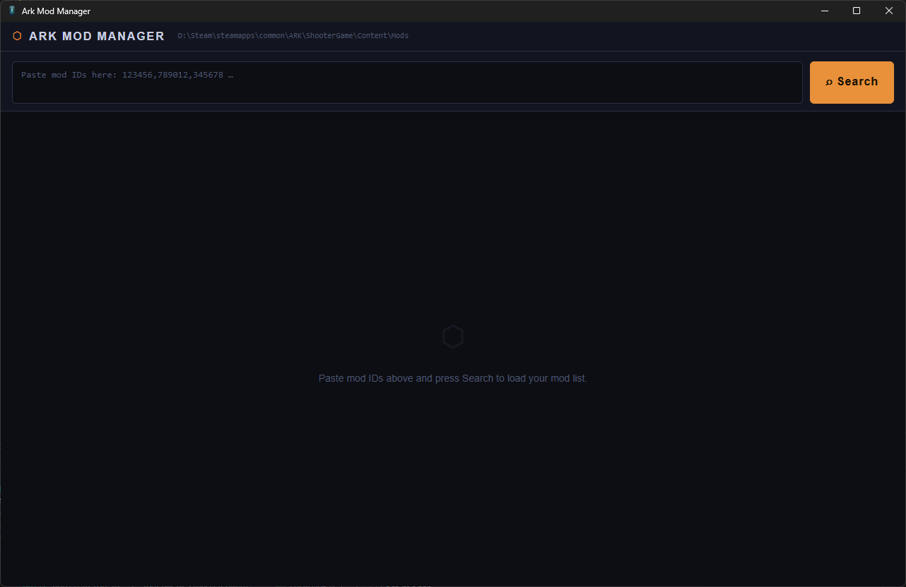
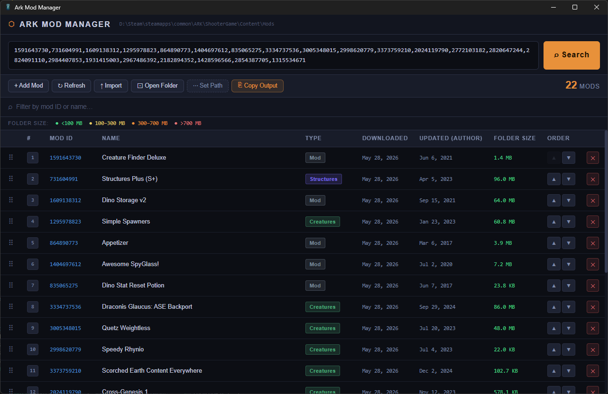

# Ark Mod Manager

[](https://anthropic.com) [](https://tauri.app) [](https://react.dev) [](https://www.typescriptlang.org)

A desktop app for managing mod load order on **ARK: Survival Evolved** dedicated servers.

Paste your mod ID list from ARK Server Manager, reorder mods with a click, and copy the result straight back — no more hand-editing comma-separated strings.

> This is the Tauri + TypeScript rewrite of the original Electron/JS app. Functionality is unchanged; the desktop shell and backend are now Rust instead of Node.

---

## Features

- **Paste & search** — paste any comma-separated mod ID list and fetch live details from Steam Workshop
- **Mod table** — see mod name, type, last downloaded, last updated (author), and local folder size in one view
- **Reorder** — move mods up/down with arrow buttons, or drag rows; the load order number updates instantly
- **Add / remove** — add individual mods by ID, remove any mod from the list
- **Filter** — search the loaded list by mod ID or name
- **Import** — import a mod list from a `.txt`, `.ini`, or `.cfg` file
- **Open folder** — jump straight to your local ARK mods directory
- **Copy output** — copies the final ordered `id1,id2,id3` string to clipboard, ready to paste back into ARK Server Manager

---

## Download

Go to the [Releases](../../releases) page and download the latest installer for your OS.

> **Windows SmartScreen warning**: Because the installer is not code-signed, Windows may show a "Windows protected your PC" dialog. Click **More info → Run anyway** to proceed. This is normal for open-source tools without a paid code signing certificate.

---

## Screenshot





---

## Development

### Prerequisites

- [Node.js](https://nodejs.org/) v18+
- [Rust](https://www.rust-lang.org/tools/install) (stable toolchain)
- Tauri's platform-specific system dependencies — see the [Tauri prerequisites guide](https://tauri.app/start/prerequisites/)

### Setup

```bash
# Install frontend dependencies
npm install

# Run in development mode (Vite dev server + Tauri window, hot reload)
npm run tauri dev

# Build a production installer for your platform
npm run tauri build
```

The installer is output to `src-tauri/target/release/bundle/`.

---

## Project structure

```
ark-mod-manager/
├── .github/
│   └── workflows/
│       └── release.yml        # Auto-build + publish on git tag (tauri-action)
├── src-tauri/                 # Rust backend
│   ├── src/
│   │   ├── main.rs            # Entry point
│   │   └── lib.rs             # Tauri commands: Steam fetch, folder scan, default path
│   ├── capabilities/
│   │   └── default.json       # Permissions granted to the main window
│   ├── Cargo.toml
│   └── tauri.conf.json        # App/window/bundle configuration
├── src/                       # React + TypeScript frontend
│   ├── components/
│   │   ├── AddModModal.tsx
│   │   ├── ModRow.tsx
│   │   ├── ToolbarBtn.tsx
│   │   └── TypeBadge.tsx
│   ├── lib/
│   │   └── tauri.ts           # Typed wrapper over Tauri commands & plugins
│   ├── utils/
│   │   └── steam.ts           # Steam API client, parseModIds, formatters
│   ├── App.tsx                # Main UI component
│   ├── App.css                # Styles (dark industrial theme)
│   ├── main.tsx                # React entry point
│   └── types.ts               # Shared TS types (Mod, SteamModDetail, …)
├── index.html                 # Vite HTML entry
├── vite.config.ts
├── tsconfig.json
├── .gitignore
├── LICENSE
├── package.json
└── README.md
```

---

## How it works

1. Paste your existing mod ID list (from ARK Server Manager or `GameUserSettings.ini`)
2. Press **Search** — the app calls Steam's `ISteamRemoteStorage/GetPublishedFileDetails` API from the Rust backend (bypassing CORS) to fetch names, types, and update timestamps
3. Optionally set your local mods folder via **⋯ Set Path** to see folder sizes and download dates
4. Use **▲▼** or drag rows to reorder, **✕** to remove, **+ Add Mod** to add by ID
5. Press **⎘ Copy Output** to copy the ordered `modid1,modid2,modid3` string back to your clipboard

---

## Architecture notes (migrated from Electron)

| Concern | Electron (old) | Tauri (new) |
|---|---|---|
| Settings persistence | `fs` JSON file via IPC | [`tauri-plugin-store`](https://v2.tauri.app/plugin/store/) |
| Steam API fetch | Node `fetch` in main process | Rust `reqwest` command (`fetch_steam_mod_details`) |
| Local folder scan | Node `fs` in main process | Rust `std::fs` command (`get_mod_folder_infos`) |
| Open folder in file manager | `shell.openPath` | [`tauri-plugin-opener`](https://v2.tauri.app/plugin/opener/) |
| Native file/folder dialogs | `dialog.showOpenDialog` | [`tauri-plugin-dialog`](https://v2.tauri.app/plugin/dialog/) |
| Reading imported file | `fs.readFileSync` | [`tauri-plugin-fs`](https://v2.tauri.app/plugin/file-system/) `readTextFile` |
| Renderer ↔ backend bridge | `contextBridge` + `ipcRenderer.invoke` | `@tauri-apps/api` `invoke()`, wrapped in `src/lib/tauri.ts` |
| Bundler | Create React App (`react-scripts`) | Vite |

The `isElectron` feature-detect became `isTauri` (from `@tauri-apps/api/core`), and `window.electronAPI.*` calls became the typed `desktopApi.*` object in `src/lib/tauri.ts` — same shape, same call sites in `App.tsx`, just typed and backed by Rust.

---

## Default mods folder locations

| OS | Path |
|----|------|
| Windows | `C:\Program Files (x86)\Steam\steamapps\common\ARK\ShooterGame\Content\Mods` |
| Linux | `~/.steam/steam/steamapps/common/ARK/ShooterGame/Content/Mods` |
| macOS | `~/Library/Application Support/Steam/steamapps/common/ARK/ShooterGame/Content/Mods` |

---

## Notes

- The Steam API endpoint used (`GetPublishedFileDetails`) does not require an API key
- Batches of up to 100 mod IDs are fetched per request
- The app works without a mods folder path set — folder size and download date columns will show `—`
- Mod IDs must be 5–12 digit numbers; anything else is silently skipped with a count shown
- You'll need to supply your own app icons under `src-tauri/icons/` before building — run `npx tauri icon path/to/logo.png` to generate the full set

---

## License

[MIT](LICENSE)
